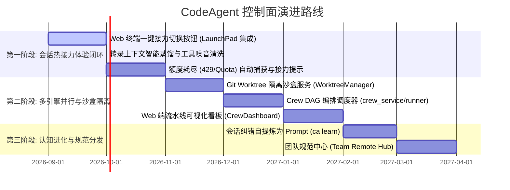

# CodeAgent 终极形态与演进路线图

> **文档版本**: 1.2.0 (明确 Meta-Harness Control Plane 定位与跨引擎接力深化方案)  
> **更新日期**: 2026-09-11  
> **状态**: 演进路线纲领与待办拆解  
> **相关文档**: [架构说明](architecture.md) · [多 Agent 协作设计](multi-agent-orchestration-design.md) · [MCP/ACP Server RFC](rfc-ca-as-mcp-acp-server.md)

---

## 1. 战略定位：什么是 Meta-Harness Control Plane？

在现代 AI 研发体系中，**底层模型正在被各大厂各自的官方 Agent（Harness）所封装**（如 Anthropic 的 Claude Code、OpenAI 的 Codex CLI、开源的 OpenCode、Google Antigravity 等）。这些官方 CLI 自身已经具备极高的单兵工程能力（自主运行命令、读写文件、甚至会话内自带 Subagent）。

**CodeAgent 不去重复造轮子去竞争“底层改代码”的能力，而是站在更高维度，作为 Multi-Harness Control Plane（多引擎管控面 / 元调度框架）运行。**

```text
┌─────────────────────────────────────────────────────────────────────────┐
│                       开发者交互界面 (Web / Terminal)                    │
└────────────────────────────────────┬────────────────────────────────────┘
                                     │ (管控、会话接力、流水线调度)
┌────────────────────────────────────▼────────────────────────────────────┐
│                  CodeAgent: Meta-Harness Control Plane                  │
│                                                                         │
│   ┌────────────────────────┐  ┌─────────────────────────────────────┐   │
│   │   统一标准主权中心     │  │      会话漫游与智能热接力           │   │
│   │ Prompts / Skills / Hooks│  │ Quota-Aware Handoff & Distillation  │   │
│   │ 跨引擎自动编译注入     │  │ Claude ↔ Codex ↔ OpenCode ↔ AGY     │   │
│   └────────────────────────┘  └─────────────────────────────────────┘   │
│                                                                         │
│   ┌────────────────────────┐  ┌─────────────────────────────────────┐   │
│   │   多 Agent 流水线编排  │  │      全场景协议中枢 (Serve)         │   │
│   │ Crew DAG / Wave 调度   │  │ FastMCP (Stdio/HTTP) 8525           │   │
│   │ Git Worktree 物理沙盒  │  │ Agent Gateway (JSON-RPC)            │   │
│   └────────────────────────┘  └─────────────────────────────────────┘   │
└────────────────────────────────────┬────────────────────────────────────┘
                                     │ (受控启动 / 环境变量 / 注入)
┌────────────────────────────────────▼────────────────────────────────────┐
│                         底层官方 CLI 引擎矩阵                           │
│     Claude Code CLI   │   Codex CLI   │   OpenCode   │   Antigravity    │
└─────────────────────────────────────────────────────────────────────────┘
```

它的核心使命是解决多引擎开发者的四大致命痛点：
1. **统一资产与规则主权（Cross-Harness Sovereignty）**：私有规范、技能与安全防线与底层具体引擎解耦，一次编写，各引擎原生自适应注入。
2. **消灭会话孤岛与中途接力（Mid-Task Handoff）**：模型额度用尽或逻辑卡壳时，会话无损、无感跨引擎接力复活。
3. **消除终端泛滥与并发踩踏（Terminal Sprawl & Git Worktrees）**：以看板化统管任务，利用 Git Worktree 物理隔离多 Agent 并发写入。
4. **全场景协议化（Universal Protocol Hub）**：自身化作 MCP Server，任何 IDE/客户端接入即可享受完整体系。

---

## 2. 现状盘点：已建成的坚实底座

经过前序迭代，CodeAgent 在管控面地基上已经走在开源前列：

### ✅ 已完成的核心资产

1. **跨引擎会话解析与重写管道 (Session Transpiler)**：
   - [`core/session_history/parsers/`](../core/session_history/parsers/)：精确解析 Claude (`.claude/projects`)、Codex (`.codex/sessions`)、OpenCode、CodeBuddy、Antigravity 原生存档。
   - [`core/session_history/writers/`](../core/session_history/writers/)：支持将抽象会话反向生成目标引擎原生存储结构。
   - [`core/cli/commands/switch.py`](../core/cli/commands/switch.py)：实现 `ca switch <target_engine>` 一键转录并直接启动。
2. **MCP Server 协议服务化 (`ca mcp serve`)**：
   - [`core/services/mcp_server_service.py`](../core/services/mcp_server_service.py)：基于 FastMCP 提供 Stdio / Streamable HTTP 双传输（8525 端口），直接向外部 Cursor/VSCode 暴露 Skills 和 Prompts。
3. **中立 Agent Gateway 与 Headless 驱动网关**：
   - [`core/services/agent_gateway/`](../core/services/agent_gateway/)：统一的会话状态机、审批流（ApprovalDecision）与看门狗重试监督。
4. **Web 端全功能交互控制台与浏览器 PTY**：
   - [`web/frontend/`](../web/frontend/)：包含 xterm.js 浏览器终端（`LaunchPad`）、Session 历史查看（`SessionsPage`）、成本统计、实例管理器。
5. **环境自愈与体检 (`ca doctor --fix`)**：
   - 完备的 CLI 依赖排查、自动软链接恢复与配置自愈。

---

## 3. 核心突破点一：跨引擎会话漫游与热接力 (Mid-Task Handoff)

虽然已有 `ca switch`，但目前处于“冷切换”阶段。结合业界最新实践，必须实现以下 **4 大深化演进**：

### 3.1 会话转录智能蒸馏与清洗 (Context Distillation)
- **痛点**：源引擎（如 Claude）通常包含上百次 `bash`、`grep`、`find` 探测产生的海量中间日志。如果原封不动塞给 Codex，会导致 Codex 上下文瞬间爆炸，产生大量噪音。
- **机制**：
  - **保留**：用户的历次 Prompt、关键修改指引、AI 的阶段性思考结论与最终生效的 Code Diff。
  - **浓缩**：将前序大量的探索性 Tool 输出，在转录为目标引擎格式时压缩为结构化的 `<context_summary>` 状态标签。
  - **收益**：目标引擎接手后，一眼看懂“上一位同事已经查清了什么、改了哪些文件”，不浪费宝贵的上下文 Token。

### 3.2 Web 终端全链路一键无感接力 (UI-Driven Handoff)
- **LaunchPad 终端顶栏**：
  - 在当前活跃的 Terminal 标签栏右侧增加 `[⚡ 接力切换引擎 ▾]` 下拉按钮。
  - 点击即可选择 `[接力给 Codex]` `[接力给 OpenCode]` `[接力给 Claude]`。
  - 自动将当前终端会话在后台即时转录，并在当前窗口新建一个 Terminal Tab 立即载入目标引擎继续会话。
- **TerminalSessionSidebar / Sessions 列表**：
  - 每个历史会话增加快捷选项：`[⚡ 以 Codex 接力打开]`。

### 3.3 额度耗尽自动容灾感知 (Quota-Aware Auto-Handoff)
- **机制**：
  - 当终端子进程或 WebSocket 拦截到底层引擎抛出 `429`、`Rate limit reached`、`Quota exceeded` 时；
  - 触发前端弹出接力卡片：*“检测到 Claude 额度达到上限，已自动抓取会话快照。是否立即接力给 Codex 继续？ [立即接力]”*；
  - 用户一键确认，开发思路不被打断。

### 3.4 会话血统与分支演进 (Session Lineage)
- 会话转录时写入 `parent_session_id` 与 `source_engine` 元数据。
- 在 Web 历史记录中呈现树状血缘关系，方便复盘对比不同模型在解决同一问题时的耗时与效果。

---

## 4. 核心突破点二：多 Agent 看板与 Git Worktree 物理沙盒

解决“多引擎并发撞车”的唯一业界标杆解法是 **Git Worktree 隔离**：

1. **声明式 Crew 流水线 (`.crew.yaml`)**：
   - 支持通过 DAG 声明阶段：`Wave 1 (Plan)` ➔ `Wave 2 (Backend & Frontend 并发)` ➔ `Wave 3 (Review)`。
2. **动态 Worktree 沙盒生命周期**：
   - 调度系统在拉起并发任务时，自动执行 `git worktree add .worktrees/<task-id> -b feat/<task-id>`。
   - 目标 CLI 引擎在独立目录运行，写代码与跑测试互不干扰。
   - 任务完成后，Web 界面统一展示修改 Diff，支持一键合并回主分支并自动销毁 Worktree。

---

## 5. 后续实施阶段与排期



---

## 6. 结语

CodeAgent 作为 Meta-Harness，**不与单点 Agent 争一日之长短，而专注于成为让所有顶级 Agent 井然有序、协同作战的工程操作系统**。
从最切合日常刚需的“跨引擎无缝接力”起步，逐步筑牢多引擎工程化协作的终极护城河。
