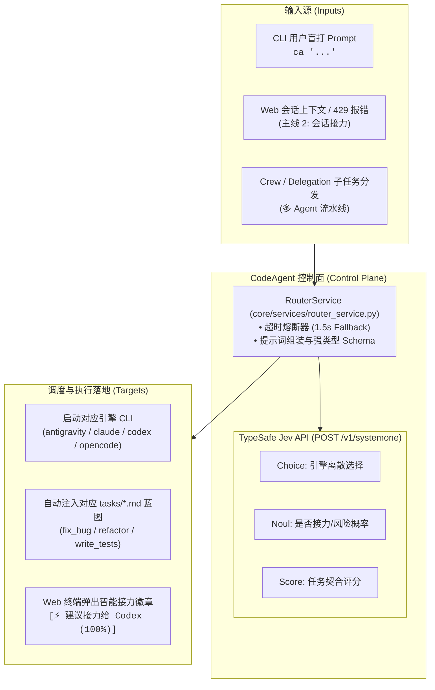
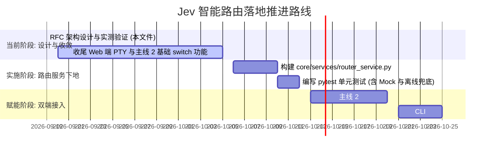

# RFC: 基于 Jev (TypeSafe AI) 的极速确定性智能路由设计

> **状态**: Draft (设计归档，待基础功能就绪后实施)  
> **日期**: 2026-09-19  
> **作者**: CodeAgent 维护团队  
> **范围**: `core/services/router_service.py`、CLI 意图盲打分流、Web 会话无缝接力推荐 (主线 2)  
> **相关**: [architecture.md](file:///E:/demo/CodeAgent/docs/architecture.md) · [future-evolution-roadmap.md](file:///E:/demo/CodeAgent/docs/future-evolution-roadmap.md) · [switch.py](file:///E:/demo/CodeAgent/core/cli/commands/switch.py) · [engine_registry.py](file:///E:/demo/CodeAgent/core/engine_registry.py) · [helpers.py](file:///E:/demo/CodeAgent/core/cli/helpers.py)

---

## 1. 摘要与战略定位

CodeAgent 的定位是 **Meta-Harness Control Plane（多引擎元管控面 / 调度框架）**。它不负责底层的具体代码生成（由底层的官方 CLI 如 Claude Code、Codex、Antigravity、OpenCode 承担），而是负责在正确的时机调度最合适的引擎、注入工程规范与自动化技能。

在此架构下，管控面长期存在一个核心抉择：**如何高效、低成本、零幻觉地做出“任务应由哪个引擎接手”、“何时该把会话接力给谁”的路由决策？**

- **传统生成式 LLM (System Two)**：如 Claude 3.7、GPT-4o，响应慢（2~10 秒）、成本高（$3~$15/M tokens）、易发生格式幻觉与漂移，**绝对不能放在毫秒级 CLI 命令或高频管控的热路径上**。
- **硬编码规则 / 正则**：速度快但毫无语义理解能力，无法处理多变的自然语言意图。

**Jev (TypeSafe AI, 2026-09)** 属于典型的 **System One（快系统决策模型）**：
- **超低延迟**：API 往返 100ms ~ 300ms（40x~200x 快于传统 LLM）；
- **微成本**：仅输入计费（$0.042 / 100 万 tokens），输出免费，成本仅为 LLM 的 1/40 ~ 1/400；
- **数学级零幻觉**：仅输出受约束的强类型结构化结果（`choice`、`score`、`noul`）；
- **实测验证**：已通过实际 API Key 联通官方 `https://api.typesafe.ai/v1/systemone`，响应 200 OK，版本 `jev-1.13.0`。

**本 RFC 提出：利用 Jev 作为 CodeAgent 控制面的极速智能路由器，赋能两大高频场景：**
1. **CLI 盲打分流**：开发者敲入 `ca "<自然语言任务>"` 时，毫秒级推断最优引擎并自动匹配 `tasks/` 蓝图。
2. **Web 会话无缝接力顾问 (主线 2 核心)**：在额度耗尽 (429) 或任务阶段转换时，为 Web 界面提供高置信度的接力目标推荐。

---

## 2. 背景与实测数据支持

### 2.1 控制面决策的性能边界

在 CodeAgent 中，CLI 用户对交互响应时间极度敏感：
- `ca` 启动延迟必须控制在 `< 500ms` 以内，否则会造成明显的卡顿感；
- Web 端在会话出错或点击切换时，接力推荐卡片必须在瞬时（`< 300ms`）弹出。

下表对比了不同方案在控制面的适用性：

| 指标 | 传统 LLM API (Claude/GPT) | 规则关键词过滤 | Jev (System One) |
| :--- | :--- | :--- | :--- |
| **平均延迟** | 2500ms ~ 6000ms | < 10ms | **150ms ~ 280ms** |
| **百万 Token 成本** | $3.00 ~ $15.00 | $0.00 | **$0.042** (几乎可忽略) |
| **语义理解深度** | 极高 | 极低（易漏判、误判） | **高（专注于意图与状态判定）** |
| **输出格式稳定性** | 易出现 markdown 乱码或解析异常 | 固定 | **100% 结构化 JSON 强类型约束** |
| **控制面可用性** | ❌ 无法放在热路径 | ⚠️ 体验粗糙 | **✅ 完美契合** |

### 2.2 关键场景实机测试记录 (2026-09-19)

使用官方 API 真实调用记录如下：

#### 测试用例 1：前端 UI 与主题重构（意图分流）
- **输入 State**: `"帮我把前端的 LaunchPad 终端界面重构一下，使用 Tailwind CSS 做响应式布局，调整暗色主题配色。"`
- **问题定义**: `recommended_engine` (choice: `antigravity`, `claude`, `codex`, `opencode`)
- **真实返回**:
  ```json
  {
    "model": "jev-1.13.0",
    "answers": {
      "recommended_engine": {
        "type": "choice",
        "choice": "antigravity",
        "confidence": 1.0,
        "probabilities": { "antigravity": 1.0, "claude": 0.0, "codex": 0.0, "opencode": 0.0 }
      }
    },
    "usage": { "input_tokens": 605, "output_tokens": 111 }
  }
  ```
  *(置信度 100% 准确命中前端视觉特化引擎 Google Antigravity)*

#### 测试用例 2：测试故障与 Bug 排查（引擎 + 任务模板双重识别）
- **输入 State**: `"测试套件中有几个关于 session parser 的单元测试偶发失败，请帮我排查原因并补全测试用例"`
- **真实返回**:
  - `recommended_engine`: `codex` (置信度 1.0)
  - `matched_task`: `fix_bug` (0.54) & `write_tests` (0.46)，其余 `code_review`、`refactor` 为 0.0。

#### 测试用例 3：主线 2 会话接力顾问（Claude 额度告急 + 单测阶段）
- **输入 State**: `"Current Engine: claude. State: Architecture design finished. Next: generate pytest test suite. System Warning: Token quota 95% depleted (429 risk)."`
- **真实返回**:
  - `should_handoff`: `noul = 0.59` (建议接力)
  - `recommended_target_engine`: `codex` (置信度 1.0，最契合工程单测编写)

---

## 3. 架构设计与系统全景



---

## 4. 详细业务场景与交互流程

### 4.1 场景一：CLI 命令行盲打与智能意图路由 (Smart Dispatch)

- **当前实现**：
  在 [helpers.py](file:///E:/demo/CodeAgent/core/cli/helpers.py) 中，`_launch_engine` 检查第一个参数是否在 `engine_script_map` 中。如果不在，则将默认引擎设为 `default_engine`（通常为 `opencode`），并将所有参数作为提示词传递。
- **增强流程**：
  1. 当 `args[0]` 不在 `engine_script_map` 且不以 `-` 开头时，识别为自然语言 Prompt。
  2. 调用 `router_service.route_prompt(prompt)`：
     - 若耗时 `< 1.5s` 且返回引擎有效：
       输出友好提示：`[智能路由] 推荐引擎: Google Antigravity (置信度 100%) | 任务类型: UI 开发`
       将 `engine_name` 设置为推荐引擎。
     - 若配置了 `matched_task` 且置信度较高，提示或自动追加 `-t <task_name>`。
  3. **优雅降级**：若未配置 API Key、网络超时或报错，静默回退至 `default_engine`，绝不阻塞用户终端。

### 4.2 场景二：Web 端一键会话无缝接力顾问 (Handoff Advisor) —— 支撑【主线 2】

- **业务背景**：
  主线 2 的目标是将 `ca switch` 无缝搬到 Web 界面上。在网页版终端或会话列表中，用户可点击「接力到其他引擎」。
- **增强流程**：
  1. **主动推荐**：当 Web 后端通过 WebSocket 或 PTY 捕获到底层引擎抛出 `Rate limit` / `429` / `Quota exhausted` 关键字时：
     - 截取当前会话最后 2 轮对话及错误信息；
     - 异步调用 `router_service.recommend_handoff(context, current_engine)`；
     - 前端主动弹窗：*“检测到 Claude 额度受限，且当前任务处于单测阶段。是否一键接力到 Codex 继续？ [立即接力]”*。
  2. **被动选择**：用户在 LaunchPad 顶栏主动点击 `[⚡ 接力切换引擎 ▾]` 下拉框时，下拉菜单第一项带有醒目的推荐徽章：
     - `Codex [推荐 100% - 适合代码生成与单测]`
     - `Antigravity`
     - `OpenCode`

### 4.3 场景三：Task 任务蓝图自动推断与推荐 (Task Classifier)

CodeAgent 的 [`tasks/`](file:///E:/demo/CodeAgent/tasks) 包含了大量专业工程流程（`code_review.md`、`fix_bug.md`、`refactor.md`、`write_tests.md`、`create_pr.md`）。
开发者通常懒得输入 `-t fix_bug`。
- Jev 对 Prompt 进行工程语义归类；
- 若匹配概率超过阈值（如 `0.5`），在注入提示词时自动附带该任务规范的标准约束（The Soul）。

---

## 5. 核心类与数据结构设计

### 5.1 数据模型定义 (`core/services/router_service.py`)

```python
from __future__ import annotations

from dataclasses import dataclass, field
from typing import Any


@dataclass(frozen=True)
class RouteDecision:
    """CLI 意图路由决策结果"""

    engine: str
    confidence: float
    probabilities: dict[str, float] = field(default_factory=dict)
    matched_task: str | None = None
    task_confidence: float = 0.0
    latency_ms: float = 0.0
    fallback: bool = False
    reason: str = ""


@dataclass(frozen=True)
class HandoffDecision:
    """会话接力推荐结果"""

    should_handoff: bool
    recommended_target: str
    confidence: float
    probabilities: dict[str, float] = field(default_factory=dict)
    reason: str = ""
    latency_ms: float = 0.0
```

### 5.2 路由器服务定义 (`RouterService`)

```python
class RouterService:
    """基于 Jev 的极速确定性决策与路由服务"""

    def __init__(
        self,
        api_key: str | None = None,
        endpoint: str = "https://api.typesafe.ai/v1/systemone",
        timeout: float = 1.5,
        default_engine: str = "opencode",
    ):
        self.api_key = api_key or os.getenv("TYPESAFE_API_KEY")
        self.endpoint = endpoint
        self.timeout = timeout
        self.default_engine = default_engine

    def is_available(self) -> bool:
        """检查路由器是否具备可用配置"""
        return bool(self.api_key)

    def route_cli_prompt(self, prompt: str) -> RouteDecision:
        """根据自然语言任务推断最优引擎及匹配任务模板"""
        if not self.is_available() or not prompt.strip():
            return RouteDecision(
                engine=self.default_engine,
                confidence=1.0,
                fallback=True,
                reason="Router unconfigured or empty prompt",
            )
        # 发送 Jev Choice 结构化请求，超时自动降级
        ...

    def recommend_handoff(
        self, context_snippet: str, current_engine: str
    ) -> HandoffDecision:
        """评估会话是否应接力，并推荐最优承接引擎"""
        ...
```

---

## 6. 配置与安全规范

### 6.1 `config.json` 扩展字段

在项目的 `config.json` 中增加可选节点：

```json
{
  "router": {
    "enabled": true,
    "provider": "jev",
    "api_key": "apikey_...",
    "timeout_seconds": 1.5,
    "auto_dispatch": true
  }
}
```

### 6.2 环境变量支持

为避免将密钥误提交至 Git 仓库，优先支持读取环境变量：
- `TYPESAFE_API_KEY`（官方标准）
- `CA_ROUTER_API_KEY`（CodeAgent 专属别名）

---

## 7. 实施计划与前置条件

鉴于当前项目的**基础功能（如 Web 端 Terminal PTY、基础 `ca switch`、多引擎适配）仍在打磨收尾阶段**，本功能的实施分为三个有序阶段：



### 实施前置条件（Checklist）
- [ ] 主线 2：Web 端基础会话格式转换与 PTY 新开 Tab 接力功能通过全量 E2E 测试。
- [ ] 确保 `uv run pytest` 和 `uv run ruff check .` 在现有代码库中 100% 保持 Clean 状态。
- [ ] 确保 `router_service.py` 内部仅使用 Python 标准库（如 `urllib.request`），无需安装新第三方依赖。

---

## 8. 总结

Jev 的引入不是为了替代任何代码生成引擎，而是为 CodeAgent 的管控面装上了一双**“高速、低耗、精准的眼睛”**。它将让 CodeAgent 从“由用户事无巨细手敲指定引擎”进化到“以意图为中心、按需无缝流转的自治操作系统”。
